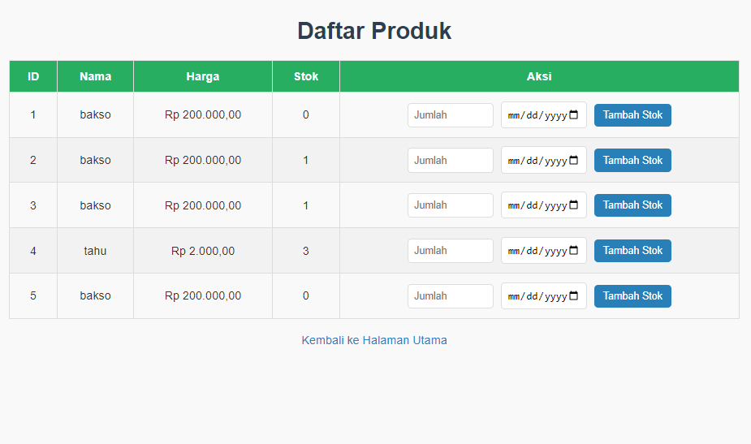
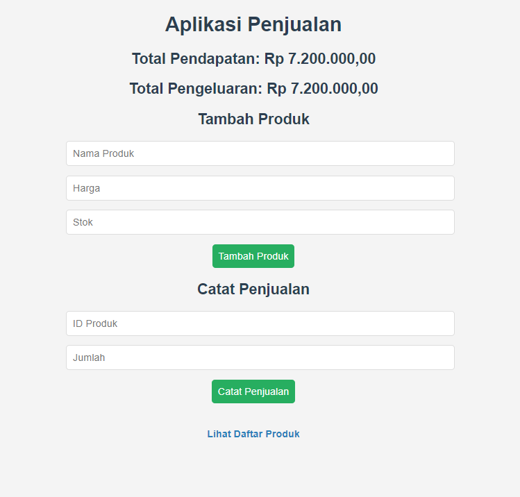

# Aplikasi Penjualan

Ini adalah aplikasi sederhana untuk mengelola produk dan penjualan. Aplikasi ini dibangun menggunakan PHP, HTML, dan CSS. Fitur-fitur utama termasuk melihat daftar produk, menambah stok produk, dan mencatat penjualan.

## Fitur Utama

- **Daftar Produk:** Menampilkan semua produk yang tersedia.
- **Penambahan Stok:** Menambah stok produk dan mencatat tanggal pembelian.
- **Pencatatan Penjualan:** Mencatat setiap transaksi penjualan.

## File Utama

1. **product_list.php**
   - Menampilkan semua produk dalam bentuk tabel.
   - Fitur untuk menambah stok produk beserta tanggal pembeliannya.

2. **index.php**
   - Berfungsi sebagai halaman utama aplikasi yang menampilkan fitur-fitur aplikasi penjualan.
   - Akses ke halaman produk dan fitur lain terkait penjualan.

## Instalasi

1. Clone repositori atau download source code.
2. Letakkan di direktori `localhost` atau server lokal lainnya (misalnya: `http://localhost/app/minggu-2/Senin/penjualanan/`).
3. Pastikan server web dan database telah terpasang (XAMPP, WAMP, atau LAMP).
4. Buat database untuk aplikasi penjualan ini.
5. Jalankan file `install.php` untuk mengatur database.

## Struktur Folder

- **db.php:** Berisi konfigurasi koneksi database.
- **function.php:** Berisi fungsi-fungsi yang digunakan di berbagai halaman.
- **install.php:** Untuk menginstal dan menginisialisasi database.
- **index.php:** Halaman utama aplikasi.
- **product_list.php:** Halaman untuk mengelola produk.

## Cara Menggunakan

1. Buka halaman utama di `http://localhost/app/minggu-2/Senin/penjualanan/index.php`.
2. Navigasikan ke halaman daftar produk di `http://localhost/app/minggu-2/Senin/penjualanan/product_list.php`.
3. Tambahkan produk atau stok jika diperlukan melalui antarmuka yang disediakan.

## Teknologi yang Digunakan

- PHP
- HTML
- CSS
- MySQLi

## Kontributor

- **Nur Wahid Aidil Nugroho**

